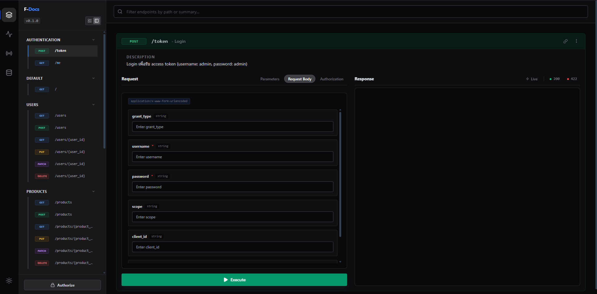

# 🚀 F-Docs

> **FastAPI documentation generator with a premium React UI.**

F-Docs is a modern, sleek, and highly functional documentation wrapper for FastAPI applications. It replaces the default Swagger/Redoc UI with a high-performance, custom-built React frontend that offers a superior developer experience.



---

## ✨ Features

- **💎 Premium React UI**: A beautiful, modern interface built with React and Vanilla CSS.
- **🏗️ Full CRUD Support**: Seamlessly handle GET, POST, PUT, PATCH, and DELETE operations.
- **🔐 OAuth2 Integrated**: Built-in support for FastAPI's OAuth2PasswordBearer flow.
- **📁 File Management**: Robust endpoints for image uploads and file retrieval.
- **🔌 Real-time Capabilities**: Support for both standard WebSockets and Socket.IO.
- **🤖 MCP Support**: Integrated Model Context Protocol (MCP) server support.
- **⚡ Fast and Lightweight**: Optimized for performance and developer productivity.

---

## 🛠️ Installation

```bash
pip install git+https://github.com/FILM6912/f-docs.git
```

Or install from local:

```bash
pip install .
```

Or install dependencies manually:

```bash
pip install fastapi uvicorn python-multipart python-jose[cryptography] passlib[bcrypt] python-socketio
```

---

## 🚀 Quick Start

Using F-Docs is as simple as wrapping your FastAPI app:

```python
from fastapi import FastAPI
from FDocs import f_docs

app = FastAPI()

# Wrap your app with F-Docs
app = f_docs(app, title="My Awesome API")

@app.get("/")
def read_root():
    return {"Hello": "World"}
```

Run your application:

```bash
python example/serve_docs.py
```

Visit your docs at `http://localhost:8000/docs` (or your configured path).

---

## 📁 Project Structure

- `FDocs/`: Core Python package implementation.
- `frontend/`: React source code for the documentation UI.
- `example/serve_docs.py`: Example server implementation with full feature demonstration.
- `pyproject.toml`: Project configuration and dependencies.

---

## 📄 License

This project is licensed under the **MIT License**. See the [LICENSE](LICENSE) file for details.

---

## 🤝 Contributing

Contributions are welcome! Please feel free to submit a Pull Request.

---

<p align="center">Made with ❤️ by FILM6912</p>
